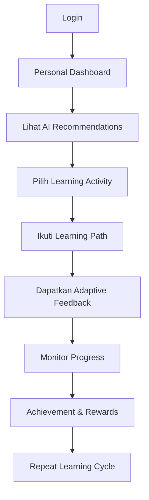
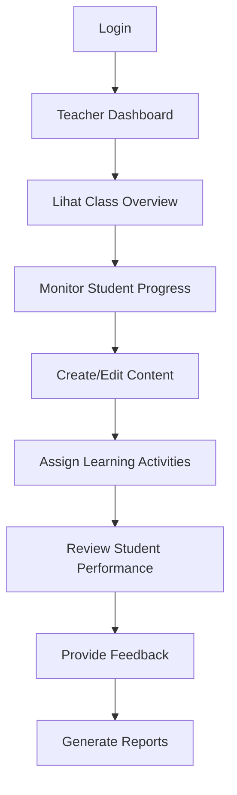
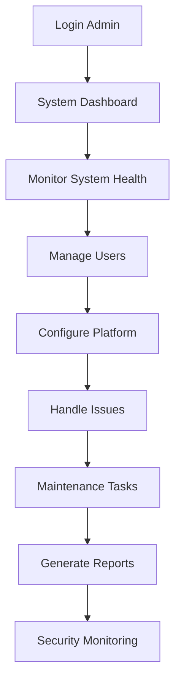

# 📚 DOKUMENTASI APLIKASI LENTERAMU

## Platform Pembelajaran Adaptif Berbasis AI

---

### 📋 **DAFTAR ISI**

1. [Overview Aplikasi](#1-overview-aplikasi)
2. [Arsitektur Sistem](#2-arsitektur-sistem)
3. [Fitur Utama](#3-fitur-utama)
4. [Menu dan Navigasi](#4-menu-dan-navigasi)
5. [Workflow Pengguna](#5-workflow-pengguna)
6. [Sistem AI & Machine Learning](#6-sistem-ai--machine-learning)
7. [Database dan Model](#7-database-dan-model)
8. [Interface Pengguna](#8-interface-pengguna)
9. [API dan Endpoint](#9-api-dan-endpoint)
10. [Instalasi dan Konfigurasi](#10-instalasi-dan-konfigurasi)
11. [Panduan Penggunaan](#11-panduan-penggunaan)
12. [Troubleshooting](#12-troubleshooting)

---

## 1. **OVERVIEW APLIKASI**

### 🎯 **Tentang LENTERAMU**

LENTERAMU (Learning Enhancement Through Adaptive Intelligence for Meaningful Understanding) adalah platform pembelajaran adaptif berbasis AI yang dirancang untuk memberikan pengalaman belajar yang dipersonalisasi untuk siswa, guru, dan administrator.

### ✨ **Visi dan Misi**

- **Visi**: Menciptakan ekosistem pembelajaran yang adaptif dan intelligent
- **Misi**: Meningkatkan efektivitas pembelajaran melalui teknologi AI dan feedback yang adaptif

### 🏆 **Keunggulan Utama**

- ✅ **AI-Powered Learning**: Sistem pembelajaran yang didukung kecerdasan buatan
- ✅ **Adaptive Feedback**: Umpan balik yang menyesuaikan dengan kemampuan siswa
- ✅ **Real-time Analytics**: Analisis performa pembelajaran secara real-time
- ✅ **Multi-Role Support**: Mendukung siswa, guru, dan administrator
- ✅ **Modern UI/UX**: Interface yang modern dan user-friendly

---

## 2. **ARSITEKTUR SISTEM**

### 🏗️ **Struktur Teknologi**

```
LENTERAMU Platform
├── Frontend (Web Interface)
│   ├── HTML5 Templates (Jinja2)
│   ├── CSS3 (Glass Morphism Design)
│   ├── JavaScript (Interactive Features)
│   └── Chart.js (Data Visualization)
├── Backend (Flask Framework)
│   ├── Route Handlers
│   ├── Session Management
│   ├── API Endpoints
│   └── Error Handling
├── Database Layer (MySQL)
│   ├── User Management
│   ├── Learning Data
│   ├── Progress Tracking
│   └── System Metrics
└── AI/ML Components
    ├── Learning Process Engine
    ├── Adaptive Feedback System
    ├── Recommendation Engine
    └── Analytics Engine
```

### 🔧 **Technology Stack**

- **Backend**: Flask 2.3.3, SQLAlchemy 2.0.23, Python 3.11
- **Database**: MySQL 8.0+ dengan PyMySQL connector
- **Frontend**: HTML5, CSS3, JavaScript ES6, Chart.js
- **AI/ML**: Scikit-learn, NumPy, Pandas
- **UI Framework**: Custom Glass Morphism dengan Font Awesome icons

---

## 3. **FITUR UTAMA**

### 👨‍🎓 **Fitur untuk Siswa**

#### 📊 **Dashboard Siswa**

- Personal learning dashboard dengan progress tracking
- AI recommendations berdasarkan learning pattern
- Real-time performance analytics
- Achievement badges dan milestone tracking

#### 🎯 **Adaptive Learning**

- Learning path yang disesuaikan dengan kemampuan
- Content recommendation yang intelligent
- Personalized feedback dari AI system
- Progress monitoring individual

#### 📈 **Analytics & Progress**

- Visual progress charts dan statistics
- Performance comparison dengan peers
- Learning streak tracking
- Detailed activity logs

### 👨‍🏫 **Fitur untuk Guru**

#### 🏫 **Class Management**

- Student overview dan progress monitoring
- Bulk operations untuk student management
- Class performance analytics
- Real-time student activity tracking

#### 📝 **Content Creation**

- Course dan subject management
- Learning activity creation tools
- Assessment dan quiz builder
- Content publishing workflow

#### 📊 **Teaching Analytics**

- Class performance insights
- Student engagement metrics
- Content effectiveness analysis
- Teaching recommendation dari AI

### 👨‍💼 **Fitur untuk Administrator**

#### 🛠️ **System Management**

- User management (students, teachers, admins)
- Role-based access control
- Bulk user operations
- System configuration

#### 📊 **Monitoring & Analytics**

- Real-time system health monitoring
- Resource usage analytics
- Performance metrics dashboard
- Error tracking dan logging

#### 🔒 **Security & Maintenance**

- Security configuration
- Audit logs monitoring
- System maintenance tools
- Emergency actions panel

---

## 4. **MENU DAN NAVIGASI**

### 🧭 **Navigation Structure**

```
LENTERAMU Navigation
├── 🏠 Beranda (/)
├── 👨‍🎓 Dashboard Siswa (/dashboard/siswa)
├── 👨‍💼 Dashboard Admin (/dashboard/admin)
├── 🛣️ Alur Kerja (Dropdown)
│   ├── 👨‍🎓 Workflow Siswa (/student/workflow)
│   ├── 👨‍🏫 Workflow Guru (/teacher/workflow)
│   └── 👨‍💼 Workflow Admin (/admin/workflow)
├── 📊 Analytics (/analytics/student)
└── 👁️ Monitoring (/monitoring)
```

### 📱 **Navigation Features**

- **Responsive Design**: Adaptif untuk desktop dan mobile
- **Dropdown Menus**: Organized workflow access
- **Icon Integration**: Font Awesome icons untuk visual clarity
- **Hover Effects**: Interactive feedback pada navigation
- **Role-based Display**: Menu yang disesuaikan dengan role user

---

## 5. **WORKFLOW PENGGUNA**

### 👨‍🎓 **Student Workflow** (`/student/workflow`)

#### 🌟 **Alur Pembelajaran Siswa**



#### 📋 **Fitur Workflow Siswa**

1. **📊 Progress Dashboard**

   - Personal progress tracking
   - Learning statistics visualization
   - Achievement badges display
   - Study streak monitoring

2. **🎯 AI Recommendations**

   - Personalized learning suggestions
   - Content recommendations
   - Study time optimization
   - Difficulty level adjustments

3. **📚 Learning Activities**

   - Interactive learning modules
   - Quiz dan assessment
   - Video learning content
   - Practice exercises

4. **🏆 Achievement System**
   - Progress milestones
   - Learning badges
   - Streak rewards
   - Performance certificates

### 👨‍🏫 **Teacher Workflow** (`/teacher/workflow`)

#### 🌟 **Alur Kerja Guru**



#### 📋 **Fitur Workflow Guru**

1. **🏫 Class Management**

   - Student roster management
   - Class performance overview
   - Attendance tracking
   - Group management tools

2. **📝 Content Creation**

   - Learning module creator
   - Quiz dan assessment builder
   - Video content integration
   - Resource library management

3. **📊 Student Monitoring**

   - Real-time progress tracking
   - Performance analytics
   - Learning behavior insights
   - Intervention recommendations

4. **🎯 Teaching Assistance**
   - AI-powered teaching suggestions
   - Content effectiveness analysis
   - Student engagement metrics
   - Personalized teaching strategies

### 👨‍💼 **Admin Workflow** (`/admin/workflow`)

#### 🌟 **Alur Kerja Administrator**



#### 📋 **Fitur Workflow Admin**

1. **🛠️ System Management**

   - System health monitoring
   - Resource usage tracking
   - Performance optimization
   - Error handling

2. **👥 User Management**

   - User creation dan deletion
   - Role assignment
   - Bulk operations
   - Access control

3. **⚙️ Platform Configuration**

   - System settings management
   - Feature toggle controls
   - Security configurations
   - Backup management

4. **🚨 Emergency Controls**
   - System maintenance mode
   - Cache clearing
   - Force user logout
   - Emergency backup

---

## 6. **SISTEM AI & MACHINE LEARNING**

### 🧠 **AI Learning Process Engine**

#### 📊 **6-Stage Learning Pipeline**

```
1. Data Collection    → Mengumpulkan data learning siswa
2. Preprocessing      → Membersihkan dan normalize data
3. Training          → Train machine learning model
4. Validation        → Validasi model performance
5. Deployment        → Deploy model ke production
6. Monitoring        → Monitor model performance
```

#### 🔧 **AI Components**

```python
# AI Learning Process
/ai/learning_process.py
├── AILearningProcess Class
├── Data Collection Methods
├── Preprocessing Pipeline
├── Model Training (Random Forest)
├── Performance Validation
└── Recommendation Generation
```

### 🎯 **Adaptive Feedback System**

#### 📊 **6-Stage Feedback Pipeline**

```
1. Assessment Data Collection  → Kumpulkan data assessment
2. Performance Analysis       → Analisis performance siswa
3. Feedback Generation       → Generate personalized feedback
4. Content Recommendation    → Recommend adaptive content
5. Personalization          → Customize learning experience
6. Effectiveness Monitoring  → Monitor feedback effectiveness
```

#### 🔧 **Feedback Components**

```python
# Adaptive Feedback System
/ai/adaptive_feedback.py
├── AdaptiveFeedbackSystem Class
├── Assessment Analysis
├── Feedback Template Engine
├── Content Recommendation
├── Personalization Engine
└── Effectiveness Tracking
```

### 📈 **AI Features**

- **Intelligent Recommendations**: Content dan learning path suggestions
- **Performance Prediction**: Prediksi hasil pembelajaran siswa
- **Adaptive Content**: Content yang menyesuaikan dengan kemampuan
- **Learning Analytics**: Deep insights tentang learning patterns
- **Automated Assessment**: Penilaian otomatis dengan AI

---

## 7. **DATABASE DAN MODEL**

### 🗄️ **Database Schema**

```sql
LENTERAMU Database Structure
├── Users (Authentication & Profiles)
│   ├── User (id, username, email, password, role, created_at)
│   ├── StudentProfile (user_id, grade_level, learning_style)
│   └── TeacherProfile (user_id, subject_expertise, experience)
├── Learning Content
│   ├── Course (id, title, description, teacher_id)
│   ├── Subject (id, name, description, course_id)
│   └── LearningActivity (id, user_id, activity_type, score)
├── AI & Analytics
│   ├── AIRecommendation (id, user_id, recommendation_type)
│   └── SystemMetrics (id, metric_name, metric_value)
```

### 📊 **Data Models**

#### 👤 **User Management Models**

```python
class User(db.Model):
    - Primary user authentication
    - Role-based access (student/teacher/admin)
    - Profile relationships

class StudentProfile(db.Model):
    - Student-specific data
    - Learning preferences
    - Academic information

class TeacherProfile(db.Model):
    - Teacher credentials
    - Subject expertise
    - Teaching experience
```

#### 📚 **Learning Content Models**

```python
class Course(db.Model):
    - Course structure
    - Teacher assignment
    - Content organization

class Subject(db.Model):
    - Subject details
    - Course relationships
    - Content categorization

class LearningActivity(db.Model):
    - Student activities
    - Progress tracking
    - Performance data
```

#### 🤖 **AI & Analytics Models**

```python
class AIRecommendation(db.Model):
    - AI-generated recommendations
    - User-specific suggestions
    - Recommendation tracking

class SystemMetrics(db.Model):
    - System performance data
    - Usage analytics
    - Monitoring metrics
```

---

## 8. **INTERFACE PENGGUNA**

### 🎨 **Design System**

#### 🌟 **Glass Morphism Design**

- **Transparency Effects**: Background blur dan opacity
- **Gradient Backgrounds**: Smooth color transitions
- **Rounded Corners**: Modern border-radius styling
- **Shadow Effects**: Layered box-shadows
- **Hover Animations**: Interactive state changes

#### 🎯 **UI Components**

```css
Design Elements:
├── Navigation Bar (Glass effect navbar)
├── Card Components (Blur backdrop cards)
├── Button Styles (Gradient buttons with hover)
├── Form Elements (Modern input styling)
├── Charts & Graphs (Interactive data visualization)
├── Modal Dialogs (Overlay components)
└── Responsive Grid (Flexible layout system)
```

### 📱 **Responsive Design**

- **Desktop (1200px+)**: Full-featured interface
- **Tablet (768px-1199px)**: Adapted layout
- **Mobile (≤767px)**: Mobile-optimized interface
- **Touch-friendly**: Optimized untuk touch interactions

### 🎭 **Interactive Features**

- **Real-time Updates**: Live data refreshing
- **Smooth Animations**: CSS transitions dan transforms
- **Loading States**: Progress indicators
- **Error Handling**: User-friendly error messages
- **Toast Notifications**: Non-intrusive notifications

---

## 9. **API DAN ENDPOINT**

### 🌐 **Main Application Routes**

```python
Core Routes:
├── GET  /                    → Home page
├── GET  /dashboard/siswa     → Student dashboard
├── GET  /dashboard/admin     → Admin dashboard
├── GET  /analytics/student   → Student analytics
├── GET  /monitoring          → System monitoring
└── GET  /ai_personalization  → AI personalization
```

### 🛣️ **Workflow Routes**

```python
Workflow Routes:
├── GET  /student/workflow    → Student workflow interface
├── GET  /teacher/workflow    → Teacher workflow interface
└── GET  /admin/workflow      → Admin workflow interface
```

### 🤖 **AI & Analytics Endpoints**

```python
AI/ML Routes:
├── POST /ai/learning-process     → Trigger AI learning process
├── POST /ai/adaptive-feedback    → Generate adaptive feedback
├── GET  /ai/recommendations      → Get AI recommendations
└── GET  /analytics/performance   → Performance analytics
```

### 📊 **Data API Endpoints**

```python
Data Routes:
├── GET  /api/users              → User data
├── GET  /api/courses            → Course data
├── GET  /api/activities         → Learning activities
├── GET  /api/metrics            → System metrics
└── POST /api/learning-activity  → Create learning activity
```

### 🔐 **Authentication Endpoints**

```python
Auth Routes:
├── POST /login                  → User authentication
├── POST /logout                 → User logout
├── POST /register               → User registration
└── GET  /profile                → User profile
```

---

## 10. **INSTALASI DAN KONFIGURASI**

### 📋 **System Requirements**

- **Python**: 3.11 atau lebih baru
- **MySQL**: 8.0 atau lebih baru
- **Memory**: Minimum 4GB RAM
- **Storage**: Minimum 1GB space
- **Browser**: Chrome 80+, Firefox 75+, Safari 13+

### ⚙️ **Installation Steps**

```bash
# 1. Clone Repository
git clone <repository-url>
cd Lenteramu

# 2. Create Virtual Environment
python -m venv venv
venv\Scripts\activate  # Windows
source venv/bin/activate  # Linux/Mac

# 3. Install Dependencies
pip install -r requirements.txt

# 4. Database Setup
mysql -u root -p
CREATE DATABASE lenteramu;
CREATE USER 'lenteramu_user'@'localhost' IDENTIFIED BY 'password';
GRANT ALL PRIVILEGES ON lenteramu.* TO 'lenteramu_user'@'localhost';

# 5. Initialize Database
python init_db.py

# 6. Run Application
python app.py
```

### 🔧 **Configuration Files**

#### `config.py`

```python
Configuration Settings:
├── Database Connection (MySQL)
├── Secret Key (Session management)
├── AI Model Settings
├── Debug Mode
└── Security Settings
```

#### `requirements.txt`

```txt
Dependencies:
├── Flask==2.3.3
├── SQLAlchemy==2.0.23
├── PyMySQL==1.1.0
├── scikit-learn==1.3.0
├── numpy==1.24.3
├── pandas==2.0.3
└── flask-session==0.5.0
```

### 🌍 **Environment Variables**

```bash
# Database Configuration
MYSQL_HOST=localhost
MYSQL_USER=lenteramu_user
MYSQL_PASSWORD=password
MYSQL_DB=lenteramu

# Application Settings
FLASK_SECRET_KEY=your-secret-key
FLASK_DEBUG=True
FLASK_ENV=development

# AI/ML Settings
AI_MODEL_PATH=models/
RECOMMENDATION_THRESHOLD=0.7
```

---

## 11. **PANDUAN PENGGUNAAN**

### 👨‍🎓 **Panduan untuk Siswa**

#### 🚀 **Getting Started**

1. **Login ke Sistem**

   - Akses http://localhost:5000
   - Gunakan kredensial yang diberikan
   - Pilih role "Student"

2. **Explore Dashboard**

   - Lihat progress pembelajaran Anda
   - Check AI recommendations
   - Monitor achievement badges

3. **Mulai Belajar**

   - Klik "Dashboard Siswa"
   - Pilih learning activity
   - Ikuti AI-guided learning path

4. **Track Progress**
   - Monitor learning statistics
   - Lihat performance charts
   - Check milestone achievements

#### 📚 **Fitur Pembelajaran**

- **Adaptive Learning Path**: Sistem akan menyesuaikan konten
- **Real-time Feedback**: Dapatkan feedback instant
- **Progress Tracking**: Monitor kemajuan belajar
- **AI Recommendations**: Saran pembelajaran personal

### 👨‍🏫 **Panduan untuk Guru**

#### 🚀 **Getting Started**

1. **Access Teacher Dashboard**

   - Login dengan role "Teacher"
   - Explore teacher workflow interface
   - Familiarize dengan class management tools

2. **Manage Students**

   - View student list dan progress
   - Monitor class performance
   - Identify students needing help

3. **Create Content**

   - Use content creation tools
   - Design learning activities
   - Set up assessments

4. **Monitor Performance**
   - Analyze class statistics
   - Review individual student progress
   - Generate performance reports

#### 📊 **Teaching Tools**

- **Class Management**: Comprehensive student oversight
- **Content Creator**: Easy content development
- **Analytics Dashboard**: Data-driven insights
- **AI Assistance**: Teaching recommendations

### 👨‍💼 **Panduan untuk Administrator**

#### 🚀 **Getting Started**

1. **System Access**

   - Login dengan role "Admin"
   - Access admin workflow interface
   - Monitor system health

2. **User Management**

   - Create/edit user accounts
   - Assign roles dan permissions
   - Manage user access

3. **System Configuration**

   - Configure platform settings
   - Monitor system performance
   - Handle maintenance tasks

4. **Monitoring & Analytics**
   - Track system usage
   - Monitor performance metrics
   - Generate system reports

#### 🛠️ **Admin Tools**

- **User Management**: Complete user control
- **System Monitoring**: Real-time health checks
- **Configuration Panel**: Platform settings
- **Emergency Controls**: Critical system actions

---

## 12. **TROUBLESHOOTING**

### 🚨 **Common Issues dan Solutions**

#### 🔧 **Database Connection Issues**

**Problem**: Cannot connect to MySQL database

```bash
Solution:
1. Check MySQL service status
2. Verify connection credentials
3. Ensure database exists
4. Check firewall settings

Commands:
mysql -u root -p
SHOW DATABASES;
SELECT user FROM mysql.user;
```

#### 🐛 **Application Startup Issues**

**Problem**: Flask app tidak start

```bash
Solution:
1. Check Python version (3.11+)
2. Verify virtual environment
3. Install missing dependencies
4. Check port availability

Commands:
python --version
pip list
pip install -r requirements.txt
netstat -an | findstr :5000
```

#### 🤖 **AI Model Issues**

**Problem**: AI recommendations tidak bekerja

```bash
Solution:
1. Check scikit-learn installation
2. Verify training data availability
3. Check model file permissions
4. Review error logs

Commands:
pip show scikit-learn
python -c "import sklearn; print(sklearn.__version__)"
```

#### 🎨 **UI/UX Issues**

**Problem**: Styling tidak load atau responsive issues

```bash
Solution:
1. Clear browser cache
2. Check static file serving
3. Verify CSS file paths
4. Test pada different browsers

Commands:
Ctrl+F5 (Hard refresh)
Check Developer Tools console
Verify network requests
```

### 📞 **Support Contacts**

- **Technical Support**: tech-support@lenteramu.id
- **User Guide**: docs@lenteramu.id
- **Bug Reports**: bugs@lenteramu.id
- **Feature Requests**: features@lenteramu.id

### 📚 **Additional Resources**

- **Video Tutorials**: YouTube channel @LENTERAMU
- **Knowledge Base**: wiki.lenteramu.id
- **Community Forum**: forum.lenteramu.id
- **Developer Docs**: dev.lenteramu.id

---

## 📊 **SYSTEM SPECIFICATIONS**

### 🔧 **Technical Specifications**

- **Framework**: Flask 2.3.3 (Python web framework)
- **Database**: MySQL 8.0+ dengan SQLAlchemy ORM
- **AI/ML**: Scikit-learn 1.3.0 untuk machine learning
- **Frontend**: HTML5, CSS3, JavaScript ES6
- **Icons**: Font Awesome 6.0.0
- **Charts**: Chart.js untuk data visualization

### 📈 **Performance Metrics**

- **Page Load Time**: < 2 seconds
- **API Response Time**: < 500ms
- **Database Query Time**: < 100ms
- **AI Recommendation Time**: < 5 seconds
- **Concurrent Users**: Up to 1000 users

### 🔒 **Security Features**

- **Session Management**: Secure Flask sessions
- **Password Security**: Hashed passwords
- **Role-based Access**: Multi-level authorization
- **Input Validation**: Comprehensive form validation
- **Error Handling**: Secure error messages

---

## 📅 **VERSION HISTORY**

### 🚀 **Version 1.0.0** (September 2025)

- ✅ Initial release dengan complete workflow system
- ✅ AI Learning Process Engine implementation
- ✅ Adaptive Feedback System
- ✅ Multi-role user interface (Student, Teacher, Admin)
- ✅ Real-time analytics dan monitoring
- ✅ Modern glass morphism UI design
- ✅ Complete database integration
- ✅ Comprehensive documentation

### 🎯 **Planned Features** (Future Versions)

- **v1.1.0**: Mobile app development
- **v1.2.0**: Advanced AI models
- **v1.3.0**: Multi-language support
- **v1.4.0**: Real-time collaboration
- **v1.5.0**: Advanced analytics dashboard

---

## 📞 **KONTAK DAN DUKUNGAN**

### 👥 **Development Team**

- **Project Lead**: LENTERAMU Development Team
- **AI Engineer**: Machine Learning Specialist
- **Frontend Developer**: UI/UX Specialist
- **Backend Developer**: Full-stack Developer
- **QA Engineer**: Quality Assurance Specialist

### 📧 **Contact Information**

- **Email**: contact@lenteramu.id
- **Website**: https://lenteramu.id
- **Documentation**: https://docs.lenteramu.id
- **Support**: https://support.lenteramu.id

### 🌐 **Social Media**

- **LinkedIn**: @LENTERAMU-Platform
- **Twitter**: @LENTERAMU_AI
- **Facebook**: @LENTERAMU.Learning
- **YouTube**: @LENTERAMU-Tutorials

---

**© 2025 LENTERAMU Platform. All rights reserved.**

_Dokumentasi ini dibuat pada September 4, 2025 dan akan terus diperbarui seiring perkembangan aplikasi._
